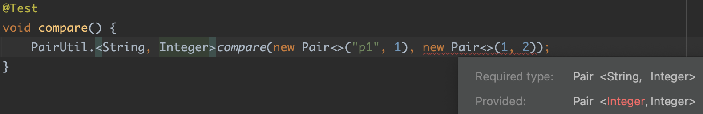
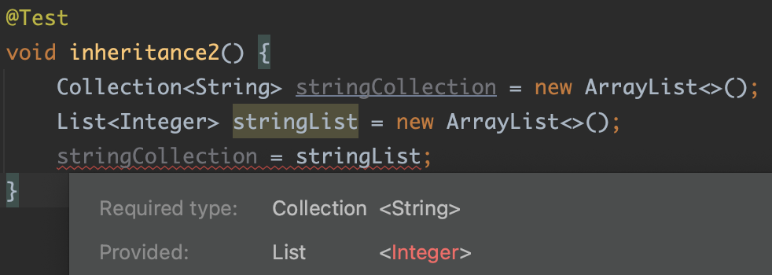

#### Generic
자바 8부터 추가된 `Generic`에 대해서 공부해보자.  

#### Why Use Generics?
공식문서에서 `Generic`을 사용해야 하는 이유를 두가지로 설명한다.

##### 컴파일 시점에 오류를 알 수 있으므로 찾기가 쉽다.
아래의 두 클래스를 비교해보자.
~~~java
public class PlainBox {
    private Object object;

    public void set(Object object) { this.object = object; }
    public Object get() { return object; }
}
~~~
~~~java
public class GenericBox<T> {
    private T t;

    public void set(T t) { this.t = t; }
    public T get() { return t; }
}
~~~

`PlainBox`를 사용해보자.  
아래의 코드는 실행하면 오류가 발생하지만 컴파일 시점에서 오류를 발견하지 못한다.  
`Object` 타입으로 보관하고 다시 꺼내기 때문이다.
~~~java
@Test
void plainBox() {
    PlainBox box = new PlainBox();
    box.set("hello");
    assertThrows(ClassCastException.class, () -> {
        Integer errorInteger = (Integer) box.get();
    });
}
~~~

같은 코드를 `GenericBox`를 통해 구현해보면,  
아래와 같이 컴파일시점에 바로 오류가 발생하게 된다.

##### 형변환을 하지 않아도되어 코드가 간결해진다.
위의 예시를 그대로 사용해보자.  

~~~java
@Test
void typeCast() {
    // 타입캐스트 필요 
    PlainBox plainBox = new PlainBox();
    plainBox.set("hello");
    String hello = (String)plainBox.get();
    
    // 타입캐스트 불필요
    GenericBox<String> genericBox = new GenericBox<>();
    genericBox.set("world");
    String world = genericBox.get();
}
~~~

##### Summary
요약하자면 `Generic`을 사용하면 컴파일 시점에 오류를 확인할 수 있고,  
코드도 간결해지므로 장점이 많다고 할 수 있다.

#### Convention
`Generic`사용 전에 몇 가지 사전지식으로 알고 갈 것이 있다.

##### type parameter, type argument
위의 `GenericBox`에서 `T`와 같은 값은 `type parameter`라고 한다.
그리고 `GenericBox` 사용시에 `GenericBox<String>`에서 `String`은 `type argument`라고 한다.  
용어의 차이를 알면 가이드를 읽을 때 도움이 된다.

##### Type Parameter Naming Conventions
`type parameter`에는 아무런 알파벳을 넣어도 관계없지만 자바 라이브러리를 포함하여 
많이 쓰이며 의미를 부여한 알파벳이 있다.

~~~
E - Element (used extensively by the Java Collections Framework)
K - Key
N - Number
T - Type
V - Value
S,U,V etc. - 2nd, 3rd, 4th types
~~~

#### Generic Methods
메서드 안에서도 `Generic`이 사용될 수 있다.  
`Generic Method`는 몇가지 특징이 있다.

~~~
- 제네릭 메서드는 메서드의 리턴파라미터 전에 타입파라미터를 명시한다.
- 타입파라미터는 제한적이다. (밑에서 추가설명한다.)
- 제네릭 메서드는 여러가지 타입파라미터를 가질 수 있으며 콤마로 구분한다. (첫번째 특징 참조)
- 메서드 바디부분은 일반 메서드와 동일하게 보여야 한다. 바디 부분에서 제네릭 메서드가 나와서는 안된다는 의미이다.
~~~

~~~java
public class Pair<K, V> {

    private K key;
    private V value;

    public Pair(K key, V value) {
        this.key = key;
        this.value = value;
    }

    public void setKey(K key) { this.key = key; }
    public void setValue(V value) { this.value = value; }
    public K getKey()   { return key; }
    public V getValue() { return value; }
}

public class PairUtil {
    public static <K, V> boolean compare(Pair<K, V> p1, Pair<K, V> p2) {
        return p1.getKey().equals(p2.getKey()) &&
            p1.getValue().equals(p2.getValue());
    }
}
~~~

##### 메서드 리턴타입 앞의 type parameter
어차피 메서드 시그니처에 `type parameter`가 다 나오는데, 굳이 리턴타입 앞에 `<K, V>`를 또 넣어주어야 할까?  
사실 잘 모르겠다. 그냥 `이 메서드에서는 K, V type parameter가 등장합니다.`라고 알려주는 역할을 한다고 생각하자.  
라고 생각해도 좋다. 하지만 이는 `type safe`를 위해 필요하다. 아래의 예시를 보자.

아래의 코드는 컴파일 오류를 발생시키지 않는다.
`compare` 의 시그니처를 보면 첫 번째 `Pair`의 `p1`과 두 번째 `Pair`의 `1`의 타입이 같지 않음을 체크해줄 것 같은데, 체크해주지 않는것이다.

~~~java
@Test
void compare() {
    PairUtil.compare(new Pair<>("p1", 1), new Pair<>(1, 2));
}
~~~

하지만 리턴타입앞에 명시해둔 `type parameter`를 사용한다면 `type safe`하게 사용할 수 있다.  
아래와 같이 컴파일시점에 오류를 체크해주기 때문이다.

##### Bounded Type Parameters
`type parameter`는 제한을 둘 수 있다.   
예를 들어 `T`로 그냥 쓴다면 이는 `Object`로 선언한 것이나 다름없게 된다.    
하지만 `<T extends Number>` 등으로 제한을 둔다면 사용상에 이점이 많이 생긴다.  

~~~java
@Test
void boundedType() {
    List<? extends Number> numbers = List.of(1, 2, 3);
    numbers.forEach(number -> System.out.println(number.intValue()));
}
~~~
위의 코드를 보면 `Number`를 상속받은 타입으로 제한하였기 때문에 `Number`에서 제공하는 `intValue` 메서드를 사용할 수 있었다.  
또한, `numbers` 선언시에 `1, 2, 3`의 값을 넣으면서 타입을 체크해주는 이점도 있었다.

#### Generics, Inheritance, and Subtypes
~~~java
@Test
void inheritance() {
    GenericBox<Number> numberBox = new GenericBox<>();
    GenericBox<Integer> integerBox = new GenericBox<>();
    numberBox = integerBox; // compile error
}
~~~
위의 코드는 컴파일오류가 발생한다.  
`Integer`는 `Number`를 상속하는데 왜 안될까?  
`Integer`는 `Number`를 상속한것은 사실이나,  
`GenericBox<Integer>`가 `GenericBox<Number>`를 상속한것은 아니기 때문이다.  
`GenericBox<Integer>`와 `GenericBox<Number>`은 `Object`를 상속하였을 뿐 전혀 관계가 없다.  
따라서 컴파일오류가 발생하게 된다.  

그럼 `Generic`의 상속은 어떻게 써야할까?  
아래의 코드는 문제없이 성공한다.
~~~
@Test
void inheritance() {
    Collection<String> stringCollection = new ArrayList<>();
    List<String> stringList = new ArrayList<>();
    stringCollection = stringList;
}
~~~
컬랙션의 상속은 아래와 같이 되어있다. 그래서 성공하는 것이다.
~~~java
public interface Collection<E>
public interface List<E> extends Collection<E> 
public class ArrayList<E> implements List<E>
~~~
상속에서 `E`가 똑같이 반복되는것을 보면 당연히 아래의 코드는 컴파일오류를 발생시킨다는 것을 알 수 있다.  

마지막으로 아래까지만 알고 넘어가자.  
아래와 같이 상속하면 어떨까? 
~~~java
interface MyList<E, V> extends List<E> {}
~~~

아래의 코드는 컴파일 성공한다.  
`MyList`의 첫 제네릭인 `E`만 `String`으로 맞추면 상속이 가능하기 때문이다.

~~~java
@Test
void inheritance() {
    MyList<String, Integer> myList1 = null;
    MyList<String, Double> myList2 = null;
    List<String> list = new ArrayList<>();
    
    list = myList1;
    list = myList2;
}
~~~

#### Reference
- https://docs.oracle.com/javase/tutorial/java/generics/why.html
- https://www.baeldung.com/java-generics