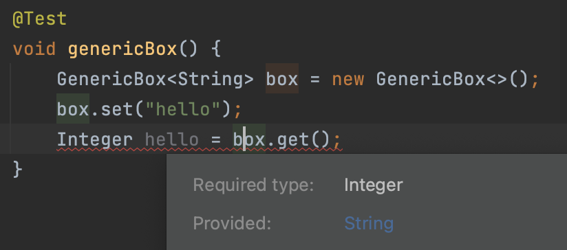

#### Generic
자바 8부터 추가된 `Generic`에 대해서 공부해보자.  

#### Why Use Generics?
공식문서에서 `Generic`을 사용해야 하는 이유를 세가지로 설명한다.

##### 컴파일 시점에 오류를 알 수 있으므로 찾기가 쉽다.
아래의 두 클래스를 비교해보자.
~~~java
public class PlainBox {
    private Object object;

    public void set(Object object) { this.object = object; }
    public Object get() { return object; }
}
~~~
~~~java
public class GenericBox<T> {
    private T t;

    public void set(T t) { this.t = t; }
    public T get() { return t; }
}
~~~

`PlainBox`를 사용해보자.  
아래의 코드는 실행하면 오류가 발생하지만 컴파일 시점에서 오류를 발견하지 못한다.  
`Object` 타입으로 보관하고 다시 꺼내기 때문이다.
~~~java
@Test
void plainBox() {
    PlainBox box = new PlainBox();
    box.set("hello");
    assertThrows(ClassCastException.class, () -> {
        Integer errorInteger = (Integer) box.get();
    });
}
~~~

같은 코드를 `GenericBox`를 통해 구현해보면,  
아래와 같이 컴파일시점에 바로 오류가 발생하게 된다.

#### Reference
- https://docs.oracle.com/javase/tutorial/java/generics/why.html