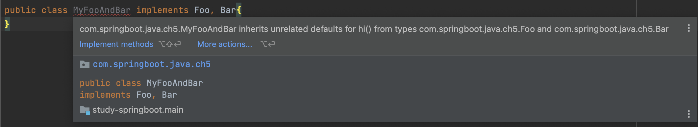
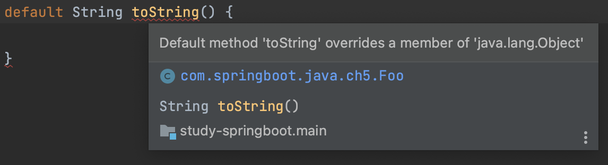

#### Interface
자바8에 들어오면서 인터페이스에 추가기능이 생겼다.  
하나씩 살펴보자.  

#### default
인터페이스에 디폴트 메서드를 추가할 수 있게되었다.  
살펴보자.  

~~~java
public interface Hello {
    void sayHello();
}
~~~

위의 예시는 기존의 인터페이스이다.  
인터페이스에 선언된 메서드는 기본적으로 public 이다.  
그런데, Hello 인터페이스를 구현한 클래스가 수십개가 되었고, 이들에 공통적으로 추가해야하는 메서드가 생겼다고 가정해보자.  
수십개의 메서드에 똑같은 코드를 복사, 붙여넣기를 해야할 것이다.  
이런 이유로 이제 default 메서드를 추가할 수 있게 되었다.

~~~java
public interface Hello {
    ...
    default void sayHi() {
        System.out.println("Hi");
    }
}
~~~

위와 같이 디폴트 메서드 `sayHi()`를 추가하면서 편리하게 되었다.  

#### default 메서드 주의사항
default 메서드의 주의사항도 두 가지정도 알고있자.  

##### 구현오류
아래와 같은 디폴트메서드가 있다고 가정해보자.   

~~~java
public interface Hi {
    default void hiUpperCase() {
        System.out.println("Hi " + getName().toUpperCase());
    }

    String getName();
}
~~~

이를 구현한 클래스는 아래와 같이 쉽게 구현할 것이다.

~~~java
public class MyHi implements Hi{
    private String name;

    public MyHi(String name) {
        this.name = name;
    }

    @Override
    public String getName() {
        return name;
    }
}
~~~

이를 사용하는 클라이언트는 어떨까?  
아래의 예시에서 `hi2`는 NPE가 발생한다.  
편의를 위해 인터페이스의 default 메서드를 사용했는데, 클라이언트가 인터페이스를 충분히 이해하지 않으면 오류가 발생한다.  
이러한 이유로 인터페이스의 default 메서드를 사용할 때에는 작성자가 설명을 충분히 해놓기를 권장하고 있다.

~~~java
@Test
void defaultInterfaceError() {
    Hi hi1 = new MyHi("june");
    hi1.hiUpperCase();
    
    // NPE
    Hi hi2 = new MyHi(null);
    hi2.hiUpperCase();
}
~~~

##### 중복구현
인터페이스는 여러개의 상속이 가능하다.  
그런데 여러개의 인터페이스에서 같은 추상메서드가 있다면?

~~~java
public interface Foo {
    void hi();
}

public interface Bar {
    void hi();
}

public class MyFooAndBar implements Foo, Bar{
    @Override
    public void hi() {
        ...
    }
}
~~~

상관없다. 어차피 새로 정의해야하기 때문이다.  
그러면 새롭게 추가된 default 메서드가 여러개라면 어떨까?  

위와 같이 컴파일오류가 발생된다.  
default 메서드는 구현한 클래스에서 공통으로 사용하기 위한 목적으로 굳이 구현하지 않아도 되었는데,  
이런 상황이 되면 둘 중 하나의 메서드를 복사해서 붙여넣거나 새롭게 정의해야 한다.

##### Object 메서드를 인터페이스의 default 메서드로 구현
`toString()`, `clone()`과 같이 Object의 메서드는 default 메서드로 구현할 수 없다.  
아래와 같은 오류가 발생한다.

다만 인터페이스에서 default가 아닌 추상메서드로는 당연히 가능하다.  
특정 객체의 경우 `toString()`이나 `equals()` 같은 메서드를 오버라이드 해야할 경우도 있을 것이기 때문이다.  

##### default 메서드 오버라이드
상속하는 객체에서 코드중복을 줄이기 위해 인터페이스에서 default 메서드를 제공하는 목적도 있다고 하였다.  
하지만, 대부분 객체에서는 default 메서드를 사용하지만 특정 상속군은 새롭게 정의해야 한다면 어떨까?  
인터페이스의 default 메서드는 다시 인터페이스로 상속받고 다시 추상화 할 수 있다.  

~~~java
public interface Hi {
    default void hiUpperCase() {
        System.out.println("Hi " + getName().toUpperCase());
    }

    String getName();
}

public interface HiWithoutDefault extends Hi {
    void hiUpperCase();
}
~~~

이제 `HiWithoutDefault`를 구현하는 클래스들은 `Hi`클래스에서 정의된 `hiUpperCase()` default 메서드를 사용할 수 없다.  
필요에따라 사용하면 되겠다.

#### static
자바8에서 인터페이스는 `static` 메서드도 선언할 수 있게 되었다.

~~~java
public interface Hi {
    static void hello() {
        System.out.println("Hello");
    }
}
~~~

사용은 다른 `static` 메서드 사용과 같다.

~~~java
@Test
void interfaceStaticMethod() {
    Hi.hello();
}
~~~