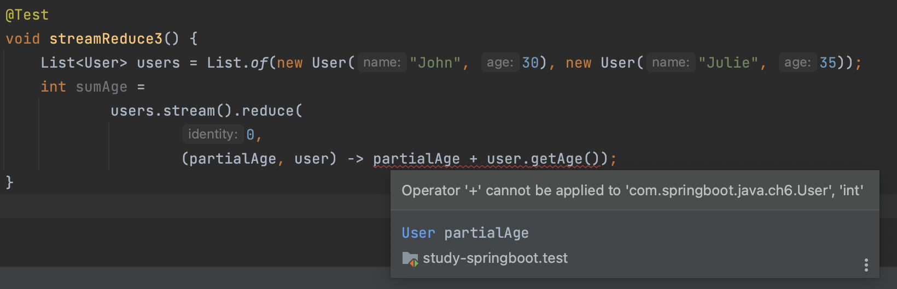

#### stream reduce
스트림 `reduce()` 함수를 알아보자.  
`reduce()`는 세개의 파라미터를 인자로 받는다.   
순서대로 아래와 같다.

~~~
identity: reduce 작업이 시작되는 시작 변수이다. 혹은 만약 reduce 의 결과값이 빈 값이면 이 값을 디폴트로 리턴한다.  

accumulator: function이다. reduce 작업이 진행되는 과정중의 결과값과 다음 인자값을 변수로 받는다. 
예를 들어, {1, 2, 3}의 합을 reduce로 연산한다면, 과정 중의 합산 값인 (1, 3, 6)이 첫 번째 인자이다.
그리고 연산 중 다음 인자 값인 {1, 2, 3}이 두 번째 인자이다.  

combiner: function이다. accumulator 만으로 연산을 적절히 수행할 수 없을때에 사용한다. example3을 참조하자.
~~~

#### example1
쉬운 예시부터 살펴보자.  
`reduce()`는 두 파라미터를 받는다.   
0은 `identity` 이며 시작값이다. 
두 번째 인자는 `BinaryOperator`이다. Integer 두 개를 인자로 받아 Integer를 리턴하는 `BiFunction`이다. 
~~~java
@Test
void streamReduce1() {
    List<Integer> numbers = List.of(1, 2, 3, 4, 5, 6);
    int result = numbers
            .stream()
            .reduce(0, (subtotal, element) -> subtotal + element);
    assertEquals(21, result);
}
~~~

#### example2
아래의 예시를 살펴보자.  
`numbers`를 `parallelStream`로 변환하여 병렬처리를 할 것이다.
이 말은 `numbers`를 여러개의 `stream`으로 쪼개고 각각 `reduce`의 연산을 호출한다는 것이다.  
그러면 병렬로 쪼개진 `stream`의 각 결과값을 어떻게 처리할지 정해야 한다.  
이 부분이 세번째 인자이다.  

~~~java
@Test
void streamReduce2() {
    List<Integer> numbers = List.of(1, 2, 3, 4, 5, 6);
    int result = numbers.parallelStream().reduce(0, (a, b) -> a + b, Integer::sum);
    assertEquals(21, result);
}
~~~

만약, `parallerlStream()`연산으로 `{1, 2}, {3, 4}, {5, 6}` 세 개의 `stream`으로 나뉘었다고 가정해보자.  
각각의 `stream`은 `3, 7, 11`의 결과값을 낼 것이고, 이를 어떻게 최종적으로 사용할지는 위 예시의 `Integer::sum`으로 결정한다.  

#### example3
아래의 코드는 컴파일되지 않는다.  
`User` 리스트를 스트림으로 변환하여 나이를 더하는 연산을 수행하려고 헀지만, 아래와 같은 오류가 발생한다.  
이유는 앞에있는 `partialAge`의 타입은 `User`인데 `+` 연산을 할 수 없다는 것이다.  
위에 말한대로 `reduce`의 두 번째 인자는 `BinaryOperator`이다. 그러면서 동시에 reduce연산의 중간결과값이기도 하다.  
나이의 합을 계산해야 하는데, 어떻게 해야할까?

아래와 같이 해야한다.

~~~java
@Test
void streamReduce3() {
    List<User> users = List.of(new User("John", 30), new User("Julie", 35));
    int sumAge =
            users.stream().reduce(
                    0,
                    (partialAge, user) -> partialAge + user.getAge(), Integer::sum);
}
~~~

두 번째 인자가 `BinaryOperator`이라고 해서 위의 캡쳐처럼 오류가 났는데,
아래와 같이 세번째 인자를 추가함으로서 다른 `reduce()` 인터페이스가 사용된 것 같다.  
따라가보자.

~~~java
<U> U reduce(U identity,
     BiFunction<U, ? super T, U> accumulator,
     BinaryOperator<U> combiner);
~~~

첫 번쨰 인자의 타입은 `U`이다.

두 번째 인자가 `BiFunction`이다. `U`와 `T`를 받아서 `U`를 리턴한다.

그리고 세번째 인자는 `U` 타입 두 개를 받아서 `U` 타입을 리턴하는 `BinaryOperator` 이다.

위의 컴파일 성공한 테스트코드를 다시 살펴보자.  
`U`는 `int`, `T`는 `User` 타입이 되겠다.
두 번째 인자는 `U`에 해당하는 `partialAge`와 `T`에 해당하는 `user`를 인자로 받아 `U` 타입을 리턴하는 `accumulator`로 해석할 수 있다.   
그리고, 새롭게 추가된 세번째 인자는 `Integer::sum` 곧 `BinaryOperator`는 컴파일 오류가 났던 부분을 부연하는 역할을 한다.
`accumulator`의 두 인자와 결과 값이 같다면 (=`BinaryOperator` 이라면) `combiner`를 사용할 필요가 없기 때문이다.
