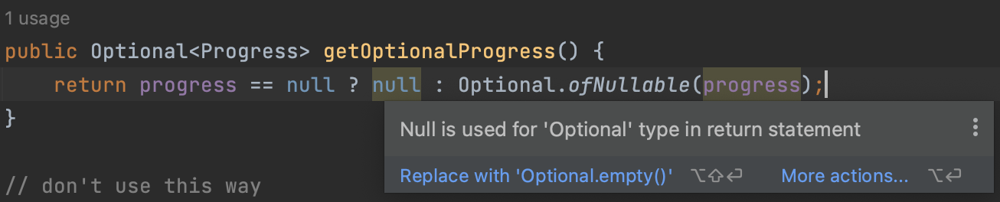
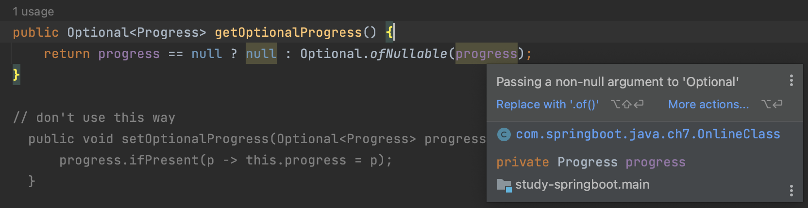
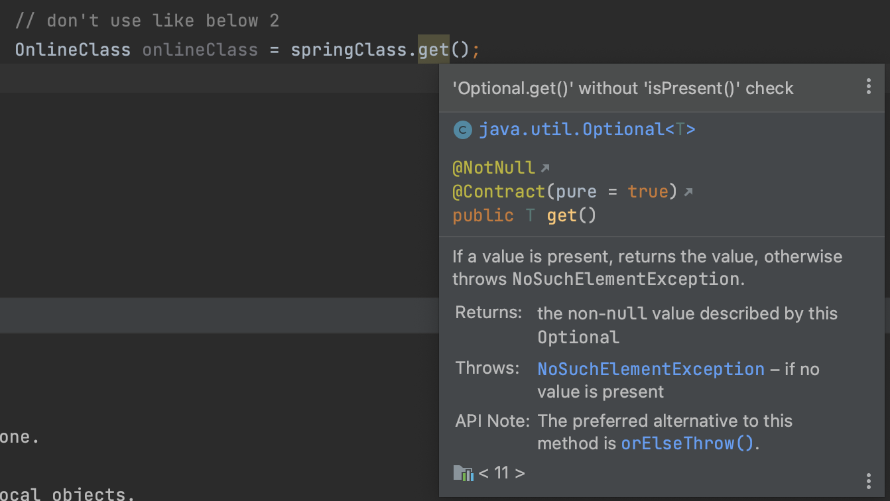

#### Optional
자바 8에서 추가된 `Optional`에 대해서 알아보자.  
이는 `NullPointerException`에 관한 것이다.  

##### example1
아래의 객체로 연습을 진행해보자.
~~~java
public class OnlineClass {
    private Integer id;
    private String title;
    private boolean closed;
    private Progress progress;
    
    // getters, setters...
}

public class Progress {
    private Duration duration;
    private boolean finished;
    
    // getters, setters...
}
~~~
아래의 코드는 `NPE`가 발생한다.  
`OnlineClass` 생성자에서 `Progress`를 넣어주지 않았으니 그렇다.
~~~java
@Test
void optional() {
    List<OnlineClass> springClasses = new ArrayList<>();
    springClasses.add(new OnlineClass(1, "spring boot", true));
    
    // NPE
    System.out.println("duration:" + springClasses.get(0).getProgress().getDuration());
}
~~~
그래서 우리는 보통 아래와 같이 개발한다.
~~~java
@Test
void optional() {
    List<OnlineClass> springClasses = new ArrayList<>();
    springClasses.add(new OnlineClass(1, "spring boot", true));
        
    // NPE fixed
    Progress progress = springClasses.get(0).getProgress();
    if (null != progress) {
        System.out.println("duration: " + progress.getDuration());
    }
}
~~~
이를 `Optional`을 사용해보자.

##### ofNullable
먼저, `getter`에서 `Optional`로 리턴하도록 변경하자.
~~~java
public class OnlineClass {
    ...
    public Optional<Progress> getOptionalProgress() {
        return Optional.ofNullable(progress);
    }
}
~~~
`Optional`로 만들 때에는 `of`와 `ofNullable`이 있다.   
`of`의 경우는 `null`이 오면 NPE가 발생한다. 가이드를 잘 읽어보고 사용하자.

#### 주의사항
##### 인스턴스 매개변수로 사용하지 말자 (반환타입으로 사용해라.)
`Optional`은 어디에 사용하든 문법적으로 아무런 제한이 없지만, 리턴타입으로만 `Optional`을 사용하자.    
`getter`, `setter` 예시에서 `setter`에 사용헀다고 가정해보자.

~~~java
public class OnlineClass {
    ...
    private Progress progress;

    public void setOptionalProgress(Optional<Progress> progress) {
        progress.ifPresent(p -> this.progress = p);
    }
~~~
`setter`부터 `Optional`로 받으니 더 안전하다고 생각되는가?
~~~java
@Test
void optional2() {
    springClasses.get(0).setOptionalProgress(null);
}
~~~
위와 같이 사용자는 얼마든지 `null`을 넣을 수 있다. 정말 괜찮은가?  
위의 `setOptionalProgress()`을 보자. `null`에 `ifPresent`함수를 실행하게 되어 `NPE`가 발생한다.  
이렇게 쓰지 말자. 

#### 인스턴스변수로 사용하지 말자
그냥 쓰지마라 구리다.

#### Optional을 반환타입으로 사용하더라도 null을 리턴해서는 안된다
~~~java
public class OnlineClass {
    ...
    public Optional<Progress> getOptionalProgress() {
        return Optional.ofNullable(progress);
    }
}
~~~
와 같이 반환타입으로 `Optional`을 잘 사용했다. 클라이언트는 아래와 같이 사용할 것이다.

~~~java
@Test
void optional2() {
    springClasses.get(0).getOptionalProgress().ifPresent(System.out::println);
}
~~~

그런데 만약 `getOptionalProgress()`에서 아래와 같이 개발했다고 가정해보자.
~~~java
public class OnlineClass {
    ...
    public Optional<Progress> getOptionalProgress() {
        return progress == null ? null : Optional.ofNullable(progress);
    }
}
~~~
인텔리제이에서는 두 가지 경고를 한다.

첫번째 경고는 `Optional` 반환타입에서 `null`을 리턴하고 있으니 조심하라는 것이다.  
왜 조심하라는 것일까?  
위의 `optional2()` 테스트를 다시 살펴보자. `getOptionalProgress()`에서 `null`을 리턴하니 `ifPresent`에서 `NPE`가 발생할 것이기 떄문이다.

두번째 경고는 아래와 같다.

`progress`는 무조건 `null`이 아니기 때문에 `ofNullable`이 아닌 `of` 함수를 쓰라는 것이다. 불필요하게 `ofNullable`을 쓰고 있다는 것이다.  

굳이 이렇게 코딩해야겠다면 차라리 아래와 같이 사용하자.

`return progress == null ? Optional.empty() : Optional.of(progress);`

#### Collection, Map, Stream등을 Optional로 감싸지 말자
`Collection, Map, Stream` 등등은 이미 `null`일 수 있음을 충분히 알수있는 함수이다.  
굳이 `Optional`로 감싸서 사용하지 않아도 된다.

#### 사용
위의 주의사항을 숙지했다면 실제로 사용해보자.

##### ifPresent
~~~java
@Test
void optional3() {
    // findAny() returns Optional type
    Optional<OnlineClass> springClass = springClasses.stream()
            .filter(onlineClass -> onlineClass.getTitle().startsWith("spring"))
            .findAny();
}
~~~

`stream`에서 `findAny() 종결형 operator`는 `Optional` 타입을 리턴한다.  
`findAny`라는 뜻 자체로 결과값이 있을수도, 없을수도 있으니 타당해보인다.  
이제 이를 꺼내서 사용해보자.

~~~java
@Test
void optional3() {
    // findAny() returns Optional type
    Optional<OnlineClass> springClass = springClasses.stream()
            .filter(onlineClass -> onlineClass.getTitle().startsWith("spring"))
            .findAny();

    // don't use like below 1
    if (springClass.isPresent()) {
        OnlineClass onlineClass = springClass.get();
    }
}
~~~

올바른 코드이지만, 위와 같이 사용하지 말자.   
`if`문을 사용하지 않고 코드를 간결하게 작성하기위해 `Optional`을 사용하는 목적도 있는데 이에 부합하지 않다.

~~~java
@Test
void optional3() {
    // findAny() returns Optional type
    Optional<OnlineClass> springClass = springClasses.stream()
            .filter(onlineClass -> onlineClass.getTitle().startsWith("spring"))
            .findAny();
    
    // don't use like below 2
    OnlineClass onlineClass = springClass.get();
}
~~~

이렇게 `get()`으로 바로 꺼내서 사용하면 안된다.  
`Optional`안에 `OnlineClass`가 있을수도 있고 없을수도 있는데 바로 꺼내면 바로 다음로직에서 `NPE`가 발생할 것이다.  
그리고 이정도는 인텔리제이에서 경고해준다.  

~~~java
@Test
void ifPresent() {
    // findAny() returns Optional type
    Optional<OnlineClass> springClass = springClasses.stream()
            .filter(onlineClass -> onlineClass.getTitle().startsWith("spring"))
            .findAny();
    
    // use ifPresent
    springClass.ifPresent(oc -> {
        // logics..
    });
}
~~~

이렇게 사용해볼 수 있다. `ifPresent` 안에있는 `Consumer`를 이용하여, 데이터가 있다면 안전하게 로직을 진행하도록 할 수 있다.

##### orElse
어떤 경우에는 위와같이 `ifPresent` 안에 모든 로직을 넣지 못할떄도 있다.  
객체를 어떻게든 가져와야 할 때에는 `orElse`를 사용할 수 있다.

~~~java
@Test
void orElse() {
    // findAny() returns Optional type
    Optional<OnlineClass> springClass = springClasses.stream()
        .filter(onlineClass -> onlineClass.getTitle().startsWith("spring"))
        .findAny();

    // orElse
    OnlineClass onlineClass = springClass.orElse(createNullOnlineClass());
}

private OnlineClass createNullOnlineClass() {
    System.out.println("create OnlineClass null instance");
    return new OnlineClass(999, "no title", false);
}
~~~

`orElse`는`Optional`에 데이터가 존재하지 않을 때 대체할 객체를 넣어주도록 한다.
여기서 개발자는 생각한다. `spring` 으로 시작하는 데이터가 있으면 그것을 가져오고, 없으면 c`reateNullOnlineClass`메서드로 생성된 객체가 들어오겠구나라고.  
반은 맞고 반은 틀리다.  
`spring`으로 시작하는 데이터가 있으면 해당 데이터를 가져오고, 없으면 `createNullOnlineClass`로 생성된 객체가 대체하는 것은 맞지만,  
`spring`으로 시작하는 데이터가 있더라도 `createNullOnlineClass` 메서드가 시행된다는 것이다.  
위의 예시에서 `spring`으로 시작하는 데이터가 있음에도 `createNullOnlineClass` 메서드는 실행된다.  
찝찝하다. 당신도 찝찝하다면 아래를 이용해보자. 

 

##### orElseGet
~~~java
@Test
void orElseGet() {
    // findAny() returns Optional type
    Optional<OnlineClass> springClass = springClasses.stream()
            .filter(onlineClass -> onlineClass.getTitle().startsWith("spring"))
            .findAny();

    // orElseGet
    OnlineClass onlineClass = springClass.orElseGet(this::createNullOnlineClass);
}
~~~
`orElseGet`을 사용하면 실제 데이터가 존재하면 굳이 `createNullOnlineClass`를 실행하지 않는다.  
다만 사용법이 조금 다르므로 인터페이스를 잘 읽어보고 사용하자.  
`orElse`는 실제 객체를 파라미터로 받고, `orElseGet`은 `Supplier`를 파라미터로 받는다.

##### orElseThrow
데이터가 존재하지 않으면 오류를 던지도록 할 수도 있다.  
기본적으로는 `NoSuchElementException`가 발생하며, 사용자 정의 오류를 `Supplier`를 통해 발생시킬수도 있다.

~~~java
@Test
void orElseThrow() {
    // findAny() returns Optional type
    Optional<OnlineClass> springClass = springClasses.stream()
            .filter(onlineClass -> onlineClass.getTitle().startsWith("notExists"))
            .findAny();

    // orElseThrow
    try {
        OnlineClass onlineClass = springClass.orElseThrow();
    } catch (NoSuchElementException e) {
        System.out.println("NoSuchElementException occurs");
    }
}
~~~

##### filter
`Optional`은 `filter`함수도 사용할 수 있다.  
`stream`에서 사용하던 개념과 다르다.  
`stream`의 `filter`는 중개형 오퍼레이터로서 `stream`을 리턴하고,   
`Optional`의 `filter`는 `optional`을 리턴한다.

~~~java
@Test
void filter() {
    // findAny() returns Optional type
    Optional<OnlineClass> springClass = springClasses.stream()
            .filter(onlineClass -> onlineClass.getTitle().startsWith("notExists"))
            .findAny();

    // filter
    Optional<OnlineClass> onlineClass = springClass.filter(oc -> oc.getId() > 99999);
    System.out.println(onlineClass.isEmpty());
}
~~~

##### map
