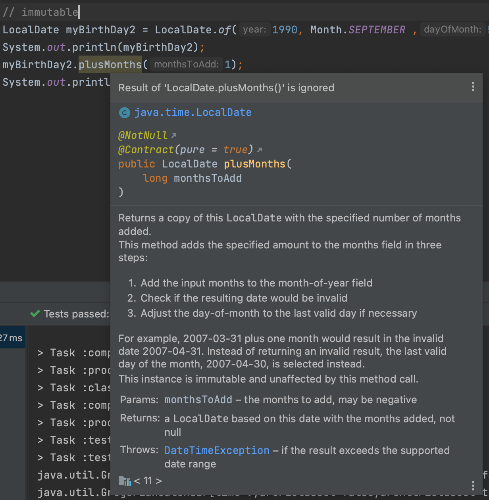

#### Date
자바 8이전의 Date와 새로나온 날짜함수를 비교해보자.

##### immutable
아래의 예시를 살펴보자.  
결론적으로 `Calendar`는 `mutable`하고 `LocalDate`는 `immutable`하다.
~~~java
@Test
void immutable() {
    // mutable
    Calendar myBirthDay1 = new GregorianCalendar(1990, 8, 5);
    System.out.println(myBirthDay1);
    myBirthDay1.add(Calendar.MONTH, 1);
    System.out.println(myBirthDay1);

    // immutable
    LocalDate myBirthDay2 = LocalDate.of(1990, Month.SEPTEMBER ,5);
    System.out.println(myBirthDay2);
    myBirthDay2.plusMonths(1);
    System.out.println(myBirthDay2);
}
~~~
`Calendar`에서 `add`는 변수 `myBirthDay1`를 변경하였지만,  
`LocalDate`에서 `plusMonths`는 변수 `myBirthDay2`를 변경하지 않았다. 
그리고 아래와같은 경고창도 보여준다.

`plusMonths`함수로 인한 결과가 무시되었다는 것이다. 새로운 변수에 할당해서 쓰라는 의미이다.

##### LocalDateTime
`LocalDateTime`을 사용할 때에 주의할 부분이 있다.  
지금까지는 그냥 편하게 사용했지만, 이제는 `Local`부분을 다시 생각해보자.  
기본적으로 시스템의 시간대를 읽어서 보여준다는 것이다.  
만약 미국의 서버에서 해당코드가 작동한다면 다른 시간이 나오는 것이다.  
이 부분을 고려하지 않고 `LocalDateTime`를 사용하지는 말자.

~~~java
@Test
void localDateTime() {
    // Instant
    Instant now1 = Instant.now();
    System.out.println(now1); // 2023-04-24T22:06:35.675183Z

    // ZoneDateTime
    ZonedDateTime now2 = ZonedDateTime.now(); 
    System.out.println(now2); // 2023-04-25T07:06:35.684582+09:00[Asia/Seoul]

    // LocalDateTime
    LocalDateTime now3 = LocalDateTime.now();
    System.out.println(now3); // 2023-04-25T07:06:35.684736
}
~~~

#### Period
`Period`가 새로 소개되었다.  
바로 사용해보자.

~~~java
@Test
void period() {
    Period period1 = Period.between(LocalDate.now().minusDays(1), LocalDate.now());
    System.out.println(period1.getDays()); // 1
}
~~~

`LocalDate`의 `between` 함수는 받는다. `날짜`까지만 받는다는 것이다.  
예를 들어, 어제와 오늘의 날짜가 변했으므로 1의 값이 필요한지, 
24시간이 지나지 않았으면 1, 아니면 0의 값이 필요한지 필요에따라 다를 수 있다.  
`Period`는 날짜만 기준으로 계산한다는 의미이다.

##### between, datesUntil
`Period`의 여러 함수를 사용해보자.  
주석을 보고 사용법을 짐작할 수 있다.  

~~~ㅓava
@Test
void period() {
    LocalDate today = LocalDate.now();
    LocalDate oneWeekAgo = LocalDate.now().minusDays(7);

    Period period1 = Period.between(oneWeekAgo, today);
    System.out.println(period1.getDays()); // 7

    Stream<LocalDate> until1 = oneWeekAgo.datesUntil(today);
    until1.forEach(System.out::println); // 2023-04-19, 2023-04-20, 2023-04-21, 2023-04-22, 2023-04-23, 2023-04-24, 2023-04-25

    Stream<LocalDate> until2 = oneWeekAgo.datesUntil(today, Period.ofDays(3));
    until2.forEach(System.out::println); // 2023-04-19, 2023-04-22, 2023-04-25
}
~~~

#### Duration
`Period`와 비슷한 개념으로 `Duration`도 같이 알아보자.  
`Duration`은 `Period`보다 날짜단위로 제한되지 않고 조금 더 자유롭다.  
`between`에 `Temporal` 타입이 들어갈 수 있으니 이를 구현하는 `LocalDate`, `LocalDateTime` 등 자유롭게 넣을 수 있다.

~~~java
@Test
void duration() {
    LocalDateTime today = LocalDateTime.now();
    LocalDateTime yesterday = LocalDateTime.now().minusDays(1).plusHours(1);

    Duration duration = Duration.between(yesterday, today);
    System.out.println(duration.toDays()); // 0
}
~~~

위의 예시는 날짜 단위가 아닌 24시간 기준으로 며칠이 지났는지 필요할때의 예시이다.