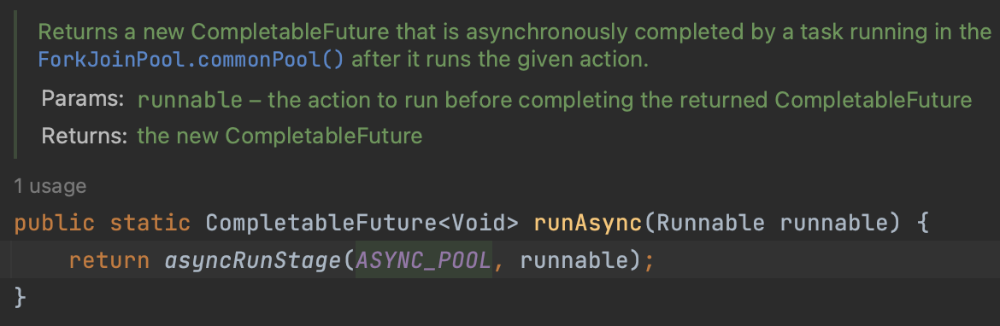

#### CompletableFuture
자바8에 생긴 `CompletableFuture`에 대해서 알아보자.  
일단 기존의 `Callable`의 불편함이 있었으니까 나왔을 것이다.  
뭐가 불편했을까?  

~~~java
@Test
void callableProblem() throws ExecutionException, InterruptedException {
    ExecutorService executorService = Executors.newFixedThreadPool(3);
    Callable<String> callable = () -> "hello";
    Future<String> future = executorService.submit(callable);

    // tasks which have nothing to do with future must be written here as much as possible  

    String hello = future.get();
    
    // you can write anything as non-blocking tasks are finished
}
~~~

`future.get()`을 호출하기 전까지만 `non-blocking`으로 처리되므로 `non-blocking`으로 처리해야하는 일들은 `get()` 호출 전까지 최대한 몰아넣어야 한다.  
`get()` 호출 전까지 아무런 로직이 없다면 굳이 병렬처리로 수행할 필요도 없다.  
이런 부분을 인지하고 개발하면 되지만 불편하긴하다.  

##### CompletableFuture
`CompletableFuture`는 뭐가 다를까?  
~~~java
@Test
void completableFuture() throws ExecutionException, InterruptedException {
    CompletableFuture<String> completableFuture1 = new CompletableFuture<>();
    completableFuture1.complete("hello1");
    System.out.println(completableFuture1.get());

    CompletableFuture<String> completableFuture2 = CompletableFuture.completedFuture("hello2");
    System.out.println(completableFuture2.get());
}
~~~
위의 예시는 기본사용예시이다. `CompletableFuture`도 똑같이 `get()`을 사용한다.  
아직까지는 `Future`와 다른게 없다.  
사용해보면서 차이점을 찾아보자.

##### runAsync
~~~java
@Test
void runAsync() {
    System.out.println("start");
    CompletableFuture.runAsync(() -> System.out.println("hello"));
    System.out.println("end");
}
~~~
위의 코드는 아래와 같이 출력되면서 비동기로 처리가 됨을 알 수 있다.
~~~
start
end
hello
~~~
무엇이 바뀌었는가?  
쓰레드를 관리해주는 `Executor`가 사라졌다.  
어디있는가?  

`runAsync`의 코드는 아래와 같다.

`ASYNC_POOL`을 통해 비동기 처리를 해주는 것이다.  
주석을 읽어보면 `ForkJoinPool.commonPool()`을 이용함을 알 수 있다.  

##### supplyAsync
리턴값이 있는 경우는 `supplyAsync`를 사용한다.  
~~~java
@Test
void supplyAsync() throws ExecutionException, InterruptedException {
    System.out.println("start");
    CompletableFuture<String> future = CompletableFuture.supplyAsync(() -> {
        System.out.println("hello");
        return "world";
    });
    System.out.println(future.get());
    System.out.println("end");
}
~~~
쓰다보니 기존의 `Future`에서 쓰레드풀을 제거해준 것 말고는 똑같아보인다.  
`get()`을 사용해야 한다면 그 이전에 비동기로 처리가능한 로직을 넣어야 하는 부분말이다.  
사실 그 부분이 불편했던 것인데 개선이 되었을까?  

##### thenApply
`thenApply`를 사용하면 기존에 `get()` 이후로 작성했던 로직을 `CompletableFuture`에 체이닝하여  
좀 더 가독성있는 코드를 만들 수 있다.  
아까 예시로 들었던 여러 은행의 API를 호출하여 모든 통장잔고의 합을 구하는 클래스를 만들어보자.
~~~java
public class MyBank {
    private int totalMoney;

    public void collectBankMoney() throws ExecutionException, InterruptedException {
        CompletableFuture<Integer> tossMoney =
                CompletableFuture.supplyAsync(() -> {
                    System.out.println("call toss..");
                    try {
                        Thread.sleep(3000);
                    } catch (InterruptedException e) {
                        throw new RuntimeException(e);
                    }
                    return 10000;
                }).thenApply(money -> totalMoney += money);
        
        CompletableFuture<Integer> kakaoMoney =
                CompletableFuture.supplyAsync(() -> {
                    System.out.println("call kakao..");
                    try {
                        Thread.sleep(2000);
                    } catch (InterruptedException e) {
                        throw new RuntimeException(e);
                    }
                    return 20000;
                }).thenApply(money -> totalMoney += money);
        
        CompletableFuture<Integer> naverMoney =
                CompletableFuture.supplyAsync(() -> {
                    System.out.println("call naver..");
                    try {
                        Thread.sleep(1000);
                    } catch (InterruptedException e) {
                        throw new RuntimeException(e);
                    }
                    return 40000;
                }).thenApply(money -> totalMoney += money);

        tossMoney.get();
        kakaoMoney.get();
        naverMoney.get();
    }

    public int getTotalMoney() {
        return totalMoney;
    }
}
~~~
클라이언트에서 아래와 같이 호출한다. 
~~~java
@Test
void collectBankMoney() throws ExecutionException, InterruptedException {
    MyBank myBank = new MyBank();
    myBank.collectBankMoney();
    System.out.println(myBank.getTotalMoney());
}
~~~
결과는 아래와 같다. 수행시간은 3초 내외이다.
~~~
call naver..
call toss..
call kakao..
70000
~~~
`get()`을 호출하지 않아도 `supplyAsync`의 코드는 동작한다.   
하지만 `get()`을 하지 않고 메서드를 종료하면, 클라이언트에서 `getTotalMoney()`를 호출하는 시점에 은행의 잔고조회가 안끝났기 때문에 0원이 조회된다.  
위의 코드에서 `get()` 세개를 주석처리하고 실행해보라.  

`supplyAsync`를 통해 비동기처리 코드가 더 간결해진 것 같다.

##### thenAccept
`thenAccept`는 리턴값이 없을때에 사용하면 된다. `Consumer`가 파라미터이다.  
위의 예시에서는 `thenAccept`를 사용해도 무방하다.

##### thenRun
`thenRun`은 비동기로직의 결과값은 필요도없고 일단 끝난 뒤에 진행하는 로직을 넣어야 할때에 사용하면 된다.

##### Summary
그래서 기존의 `Future`의 불편함이 해소되었는가?  
쓰레드풀을 별도로 생성하지 않아도 되고 (다른 쓰레드풀을 사용해야 한다면 생성해서 주입할 수 있다.),  
`get()` 뒤에 있던 로직을 비동기 호출로직에 체이닝함으로서 로직도 가독성이 좋아졌다.  
아무래도 장점이 많은 것 같다.

#### 심화
`CompletableFuture`에 대한 기본지식은 이정도면 된 것 같다. 실제 사용하면서 조금더 알아보자.  

##### thenCompose
`CompletableFuture`는 메서드 체이닝이 잘되어있다.  
여러 `async`작업을 합쳐서 사용해보자.  
`thenCompose`를 이용하여 `async` 호출의 반환값을 이용하여 다른 `async` 호출을 할 수 있다.  
작업간에 순서의존성이 있는 경우 유용하겠다.

~~~java
@Test
void thenCompose() throws ExecutionException, InterruptedException {
    CompletableFuture<String> hello = CompletableFuture.supplyAsync(() -> {
        System.out.println("hello thread: " + Thread.currentThread().getName());
        return "hello";
    });

    CompletableFuture<String> future = hello.thenCompose(s -> world(s));
    System.out.println(future.get()); // hello world
}

private CompletableFuture<String> world(String str) {
    return CompletableFuture.supplyAsync(() -> {
        System.out.println("world thread: " + Thread.currentThread().getName());
        return str + " world";
    });
}
~~~

##### thenCombine
두 개의 작업을 `async`로 수행하고 각각의 결과값을 모두 받아 또다른 작업을 할 수도 있다.  

~~~java
@Test
void thenCombine() throws ExecutionException, InterruptedException {
    CompletableFuture<String> hello = CompletableFuture.supplyAsync(() -> {
        System.out.println("hello thread: " + Thread.currentThread().getName());
        return "hello";
    });
    CompletableFuture<String> world = CompletableFuture.supplyAsync(() -> {
        System.out.println("world thread: " + Thread.currentThread().getName());
        return "world";
    });

    CompletableFuture<String> future = hello.thenCombine(world, (s1, s2) -> s1 + " " + s2);
    System.out.println(future.get());
}
~~~
처음에는 위의 결과값이 `hello world, world hello` 둘 다 나올 수 있다고 생각했지만, 항상 `helloworld`를 반환한다.  
`s1`은 `hello`의 반환값, `s2`는 `world`의 반환값이기 때문이다.  

##### allOf
두 개의 작업이 아닌 여러개의 작업을 병렬로 호출하고 결과값을 이용하고 싶을 수 있다.  

~~~java
@Test
void allOf() {
    CompletableFuture<String> hello = CompletableFuture.supplyAsync(() -> {
        System.out.println("hello thread: " + Thread.currentThread().getName());
        return "hello";
    });
    CompletableFuture<String> java = CompletableFuture.supplyAsync(() -> {
        System.out.println("java thread: " + Thread.currentThread().getName());
        return "java";
    });
    CompletableFuture<String> world = CompletableFuture.supplyAsync(() -> {
        System.out.println("world thread: " + Thread.currentThread().getName());
        return "world";
    });

    CompletableFuture<Void> futures = CompletableFuture.allOf(hello, java, world);
}
~~~
위의 예시에서 `allOf`의 반환값이 `CompletableFuture<Void>`이다. 굉장히 이상하다.  
세 작업의 결과값이 전부 `CompletableFuture<String>`인데 `List<CompletableFuture<String>>`이 나와야 하는것 아닌가?  
`allOf`의 인자로 들어올수 있는 것들이 같은 타입이 아닐 수 있기 때문이라는 설명은 납득이 안된다. 전부 `CompletableFuture<String>`으로 지정하지 않았는가.  
여러개의 호출 중 실패한 작업이 있을 수 있기 때문이라는 설명이 그나마 조금 설명이 된다.  
100개의 작업 중 1개가 실패하면 99개의 리스트를 리턴할 것인가, 아니면 작업자체를 실패시켜야 하는가의 문제가 있을 수 있다.  

어찌됬든 지금은 리턴타입이 `CompletableFuture<Void>`이기때문에 원하는 작업을 하려면 아래와 같이 수행해야 한다.  

~~~java
@Test
void allOf2() throws ExecutionException, InterruptedException {
    CompletableFuture<String> hello = CompletableFuture.supplyAsync(() -> {
        System.out.println("hello thread: " + Thread.currentThread().getName());
        return "hello";
    });
    CompletableFuture<String> java = CompletableFuture.supplyAsync(() -> {
        System.out.println("java thread: " + Thread.currentThread().getName());
        return "java";
    });
    CompletableFuture<String> world = CompletableFuture.supplyAsync(() -> {
        System.out.println("world thread: " + Thread.currentThread().getName());
        return "world";
    });

    CompletableFuture<String>[] futures = new CompletableFuture[]{hello, java, world};
    CompletableFuture<List<String>> results = CompletableFuture.allOf(futures)
            .thenApply(v -> // v는 아무런 의미가 없다.
                    // thenApply는 allOf 리스트의 모든 작업이 끝났음을 의미한다.
                    // 미리 지정해둔 futures를 순회하면서 join을 통해 결과값들을 리스트로 다시 저장한다.
                    Arrays.stream(futures)
                            .map(CompletableFuture::join)
                            .collect(Collectors.toList()));

    results.get().forEach(System.out::println);
}
~~~
`join`은 처음 쓰였는데 `get`과 같지만 `unchecked` 예외를 발생시키는 정도로만 이해하자.  
`솔직히 invokeAll이 훨씬 편하다.`